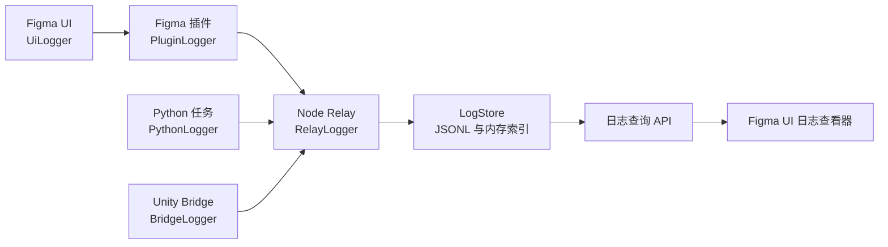

# Figma MCP Relay 全链路日志系统设计

## 1. 目标

为 Figma MCP Relay 的完整运行链路建立可检索、可关联、可降级的结构化日志系统。日志覆盖 Node Relay、Figma 插件、Figma UI、Python 任务和 Unity Bridge，使一次用户操作能够通过同一个 `operationId` 追踪从入口到最终结果的全部业务步骤。

本设计要求：

- 每个业务操作必须记录开始、关键步骤和终态。
- 每个运行环境只能通过独立日志类输出诊断日志。
- 日志查询能够定位失败来源、失败步骤和完整错误堆栈。
- 日志系统故障不能导致正常业务失败。
- 敏感信息和大体积载荷不得原样写入日志。

## 2. 范围

纳入日志改造的运行环境：

- Node/TypeScript Relay。
- Figma 插件主线程 JavaScript。
- Figma UI WebView。
- Python Relay、Companion、客户端和业务任务。
- Unity Editor Bridge C#。

纳入日志覆盖的业务边界：

- 服务启动、停止和配置读取。
- HTTP、MCP 和 WebSocket 请求。
- Figma 插件连接、命令接收、执行和响应。
- AI Provider 探测、计划生成、CLI 调用、超时和取消。
- Cleanup 分析、审批、执行、回滚和结果验证。
- PSD/Prefab 导入、导出及阶段进度。
- Unity 项目发现、Bridge 安装、连接和资源处理。
- 文件写入、外部进程和跨运行端调用。
- 用户主动取消、自动重试和自动降级。

不记录每个函数调用、循环项或心跳。高频细节仅在 `debug` 或 `trace` 级别输出。

## 3. 方案选择

采用“各端独立日志类、统一事件结构、Node Relay 集中汇总”的方案。

每个运行环境使用一个日志类：

- TypeScript：`RelayLogger`。
- Figma 插件：`PluginLogger`。
- Figma UI：`UiLogger`。
- Python：`PythonLogger`。
- Unity：`BridgeLogger`。

不同语言无法共享同一个代码类，因此统一共享的是日志事件协议、关联上下文、脱敏规则和生命周期语义。业务模块只引用所在环境的日志类，不直接调用 `console.*`、`print`、`Debug.Log` 或自行写日志文件。

未采用的方案：

- 所有日志只实时发送给 Node：Relay 断开时会丢失关键诊断信息，并让日志通道过度依赖业务通道。
- 各端完全独立记录、查询时临时合并：跨端时间线和因果关系不可靠，无法稳定定位超时边界。

## 4. 总体架构



`operationId` 在首次进入 Figma UI、HTTP 或 MCP 时生成，并通过现有业务数据流继续传递：

- UI 与插件之间的 `postMessage` 消息上下文。
- 插件与 Relay 之间的 WebSocket Job/Result 信封。
- Relay 创建 Python 子进程时的环境变量或参数。
- Relay 与 Unity Bridge 之间的 HTTP 请求头或请求体。

日志关联上下文是现有业务信封中的可选字段，不建立第二套业务命令通道。

## 5. 统一日志事件

所有运行端产生相同语义的日志事件：

```typescript
interface LogEvent {
  timestamp: string;
  level: "trace" | "debug" | "info" | "warn" | "error" | "fatal";
  source: "ui" | "plugin" | "relay" | "python" | "unity";
  module: string;
  operationId: string;
  operationName: string;
  step: string;
  stepIndex: number;
  status: "started" | "progress" | "succeeded" | "failed" | "cancelled";
  message: string;
  durationMs?: number;
  data?: Record<string, unknown>;
  error?: {
    name?: string;
    code?: string;
    message: string;
    stack?: string;
  };
  ingestedAt?: string;
  ingestSequence?: number;
}
```

Relay 在接收其他运行端的日志后补充 `ingestedAt` 和单调递增的 `ingestSequence`。查询时间线优先保留业务步骤顺序，并使用接收顺序处理运行端时钟的轻微偏差。

## 6. 日志类 API

各语言实现保持以下概念接口：

```text
startOperation(name, context) -> OperationScope
scope.step(stepName, data)
scope.succeed(data)
scope.fail(error, data)
scope.cancel(reason)
logger.debug/info/warn/error(message, context)
logger.writeProtocolOutput(payload)
```

`OperationScope` 负责：

- 生成或继承 `operationId`。
- 维护 `stepIndex`。
- 计算步骤和整次操作耗时。
- 确保每个 `started` 最终对应一个 `succeeded`、`failed` 或 `cancelled`。
- 捕获并标准化异常堆栈。
- 在输出前应用脱敏和载荷截断。
- 在重复终结操作时忽略第二次终结并写入内部警告。

日志类本身不得将写入异常抛给业务调用方。

CLI 或 MCP stdio 的机器可读协议输出是直接输出限制的唯一例外，但也必须通过 `writeProtocolOutput` 写入，以确保协议 stdout 与诊断 stderr 不混流。

## 7. 运行端职责

### 7.1 Node Relay

`RelayLogger` 是 TypeScript 业务代码的唯一日志入口。现有 `logInfo`、`logWarn`、`logError` 等导出在迁移期间保留为兼容适配器，内部转发到 `RelayLogger`，避免与工作区现有改动发生大面积冲突。

Node Relay 还负责：

- 接收其他运行端的批量日志。
- 二次脱敏和事件校验。
- 持久化、轮转和清理日志文件。
- 维护最近日志的内存索引。
- 提供日志查询和下载接口。

### 7.2 Figma UI

`UiLogger` 记录用户交互、请求发起、响应、取消和 UI 侧异常。日志先进入有限长度队列，再通过现有 `postMessage` 批量交给插件。队列满时优先保留 `warn`、`error` 和 `fatal`。

### 7.3 Figma 插件

`PluginLogger` 记录插件生命周期、选择读取、命令执行、Figma 节点变更和结果发送。插件断开 Relay 时保留有限长度的关键日志，WebSocket 恢复后批量提交。

### 7.4 Python

`PythonLogger` 将结构化诊断日志写入 `stderr`。Node 启动的 Python 任务继承 `operationId`，Node 解析其结构化 stderr 并汇入 `LogStore`。必须写入 stdout 的 JSON 协议结果通过 `writeProtocolOutput` 输出。

### 7.5 Unity Bridge

`BridgeLogger` 取代 `FigmaBridgeServer.AddLog` 作为唯一日志源。Unity 窗口订阅 `BridgeLogger` 的事件展示日志，不再维护独立日志内容。Bridge 保留本地环形缓冲区并提供只读日志端点，Relay 在查询诊断信息时合并 Unity 日志。

## 8. 存储与保留

Node Relay 的 `LogStore` 使用 JSON Lines：

- 文件路径：`.logs/relay-YYYY-MM-DD.jsonl`。
- 文件日期和事件时间均使用 UTC。
- 默认保留 14 天。
- 所有日志文件总大小上限为 200 MB。
- 超过时间或体积限制时优先删除最旧文件。
- 启动时和每日轮转时执行清理。
- 内存索引默认保留最近 1,000 条脱敏事件。

UI 和插件的离线队列，以及 Unity 的环形缓冲区，都必须有固定条数和字节上限，不能无限增长。

## 9. 查询 API 与 UI

日志 API 仅接受本机允许来源，并复用现有会话或能力校验：

- `POST /logs/events`：接收批量日志事件。
- `GET /logs`：按时间、级别、来源、模块、状态、关键词和 `operationId` 查询。
- `GET /logs/operations/{operationId}`：返回一次操作的完整时间线。
- `GET /logs/download`：下载筛选后的诊断日志。
- `GET /log`：作为兼容入口返回真实日志，不再返回固定空数组。

Figma UI 日志查看器支持：

- 按级别、来源、模块和时间筛选。
- 搜索消息、错误码和 `operationId`。
- 展开结构化上下文及错误堆栈。
- 一键复制 `operationId`。
- 下载当前筛选结果或完整诊断包。
- 默认加载最近 1,000 条，继续加载使用分页查询。

## 10. 脱敏和载荷限制

日志类和 Relay 汇总端都执行脱敏。至少遮蔽：

- Password、Token、Authorization、Cookie、API Key 及大小写变体。
- CLI 或 Provider 凭据和环境变量中的密钥。
- Base64、PSD 内容、图片字节和超大请求正文。

大体积内容只记录类型、字节数、摘要和哈希。单条事件超过大小上限时截断 `data`，保留错误、操作上下文和 `truncated=true` 标记。

## 11. 故障处理

日志故障采用 fail-open 策略：

1. 主日志目标写入失败时尝试紧急日志文件。
2. 紧急文件不可写时退回原生 `stderr`。
3. 紧急输出不调用主日志类，避免递归故障。
4. 日志上传失败只进入本地缓冲区，不阻塞业务请求。
5. 本地缓冲区达到上限时优先丢弃低级别和最旧日志，并记录一次汇总警告。

## 12. 迁移顺序

1. 为事件协议、脱敏和 `OperationScope` 编写失败测试。
2. 实现 TypeScript `RelayLogger` 与 `LogStore`。
3. 保留旧函数兼容适配器，迁移 Node 业务边界。
4. 实现 `PluginLogger` 和 `UiLogger`。
5. 实现 `PythonLogger`，分离协议 stdout 和诊断 stderr。
6. 实现 `BridgeLogger`，让 Unity 窗口订阅日志事件。
7. 完成查询 API、UI 筛选和诊断日志下载。
8. 删除业务模块中遗留的直接诊断输出。
9. 执行自动化和真实跨端验证。

## 13. 测试策略

测试优先覆盖：

- 日志事件字段、级别和序列化。
- 操作生命周期只能拥有一个终态。
- `operationId` 跨 HTTP、WebSocket、Python 和 Unity 传递。
- 敏感字段、Base64 和超大载荷脱敏。
- 文件轮转、14 天保留和 200 MB 上限。
- 查询、筛选、分页和下载。
- 日志存储故障后的紧急降级。
- UI/插件离线缓冲和重连批量提交。
- Python stdout/stderr 协议隔离。
- Unity 日志缓冲和只读日志端点。

验证层级：

- TypeScript 类型检查和 Node 自动化测试。
- Python 自动化测试和语法检查。
- Figma 插件构建与 UI 测试。
- Unity Editor 编译检查。
- 真实启动 Relay，执行一次跨端操作，并使用同一个 `operationId` 查看完整时间线。

## 14. 完成标准

- 所有业务操作都有开始、关键步骤和终态日志。
- 业务文件不再直接调用诊断型 `console.*`、`print` 或 `Debug.Log`。
- 协议输出统一通过日志类的 `writeProtocolOutput`。
- `/log` 返回真实日志。
- UI 能定位失败发生的运行端和步骤，并显示完整错误堆栈。
- 日志脱敏、保留期和体积上限均有自动化证明。
- 日志系统失败不会导致业务失败。
- 真实跨端验证能够以一个 `operationId` 还原完整操作时间线。
- 工作区现有无关改动未被覆盖、回退或混入日志设计提交。

